1. **Network Setup**
    - Create a VPC with CIDR block 10.0.0.0/16
    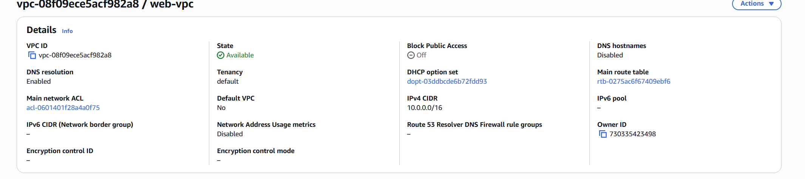

    - Create 4 subnets in 2 Availability Zones:
        - 2 public subnets (10.0.1.0/24, 10.0.2.0/24)
        - 2 private subnets (10.0.3.0/24, 10.0.4.0/24)  
    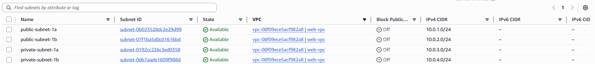

    - Configure Internet Gateway and NAT Gateway
    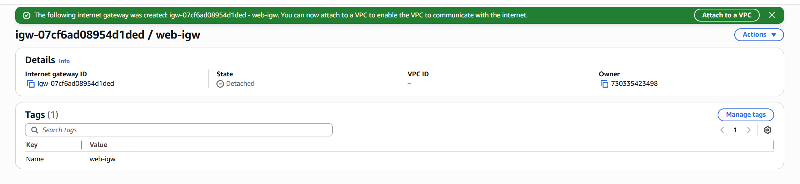
    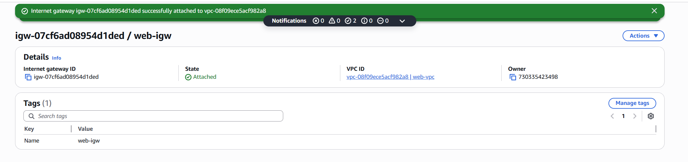

    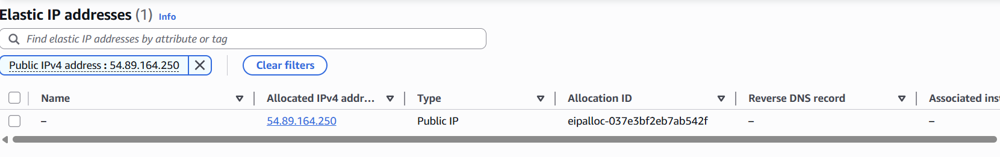
    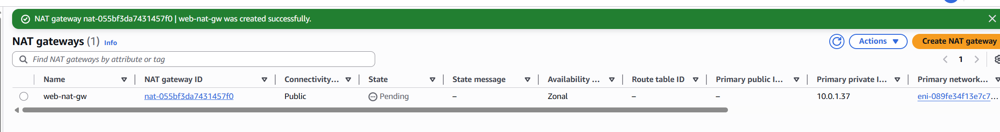

    - Set up basic route tables
    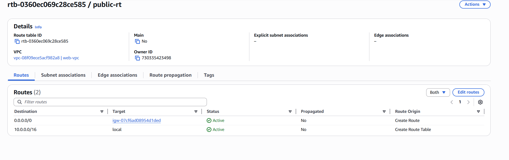
    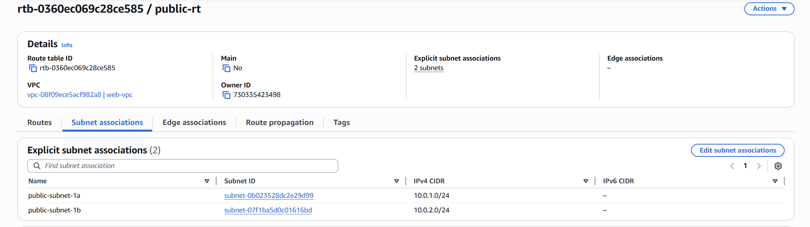

    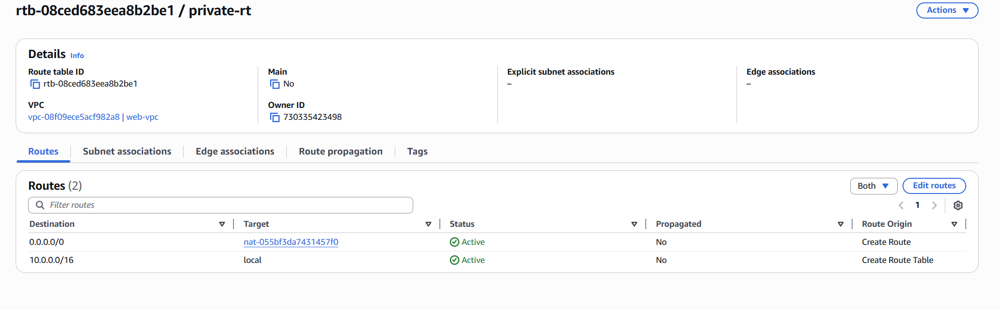
    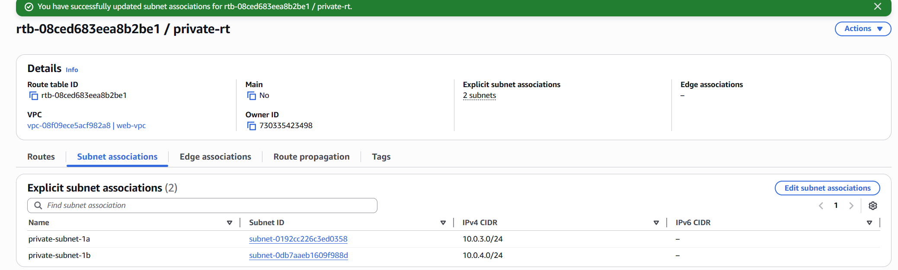

2. **Web Layer:**
    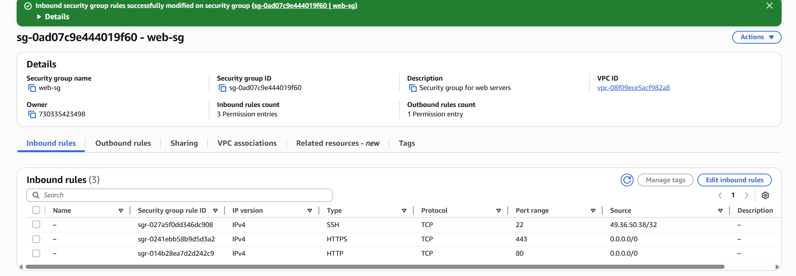

    - Launch 2 EC2 instances in public subnets
    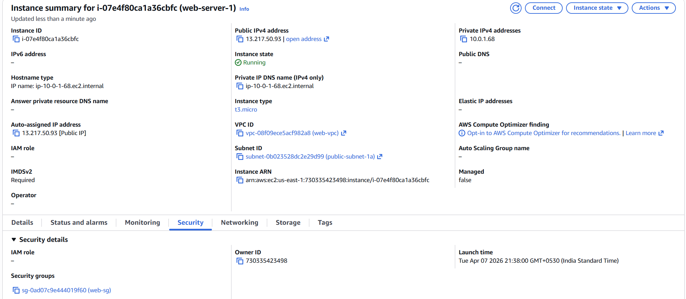
    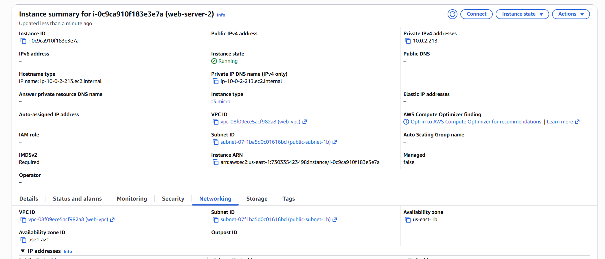
    - Install Apache web server with a simple "Hello World" page
    - Create basic security groups (HTTP/HTTPS from internet)
    - Set up an Application Load Balancer
    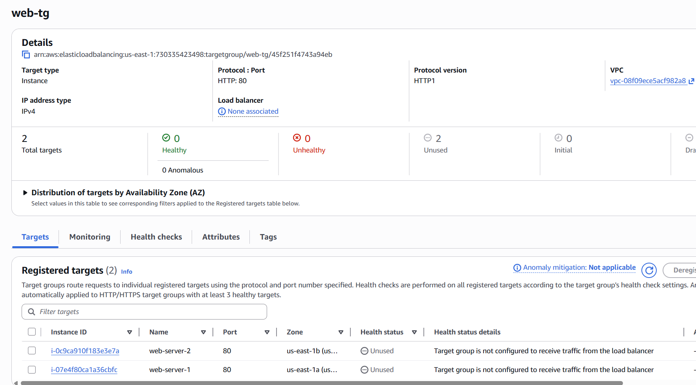
    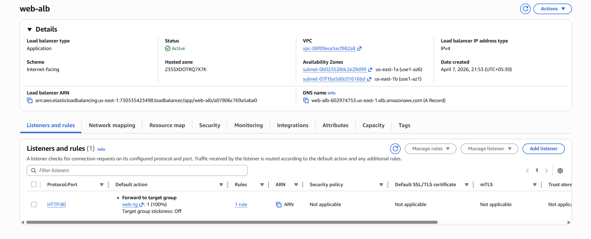
    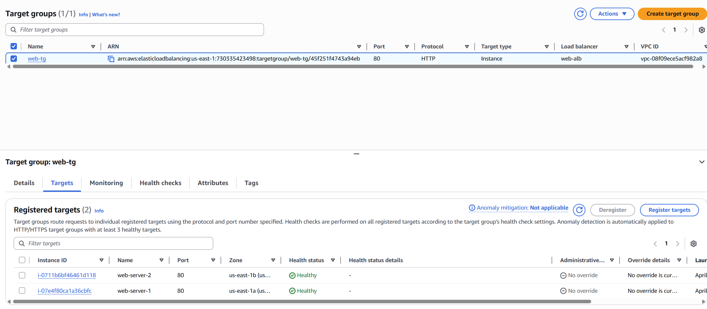

3. **Database Layer:**
    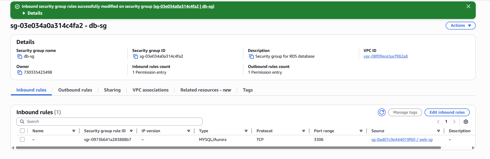
    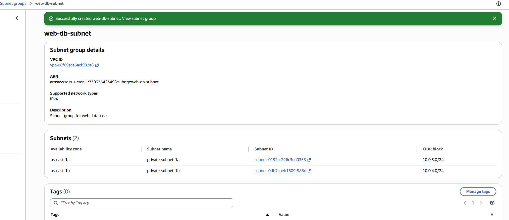
    - Create a simple RDS MySQL database in private subnet
    - Configure security group to allow access only from web servers
    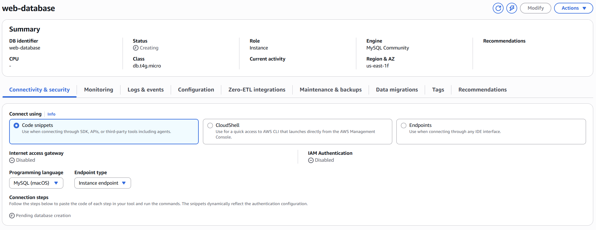
    

**Deliverables:**

- Architecture diagram
  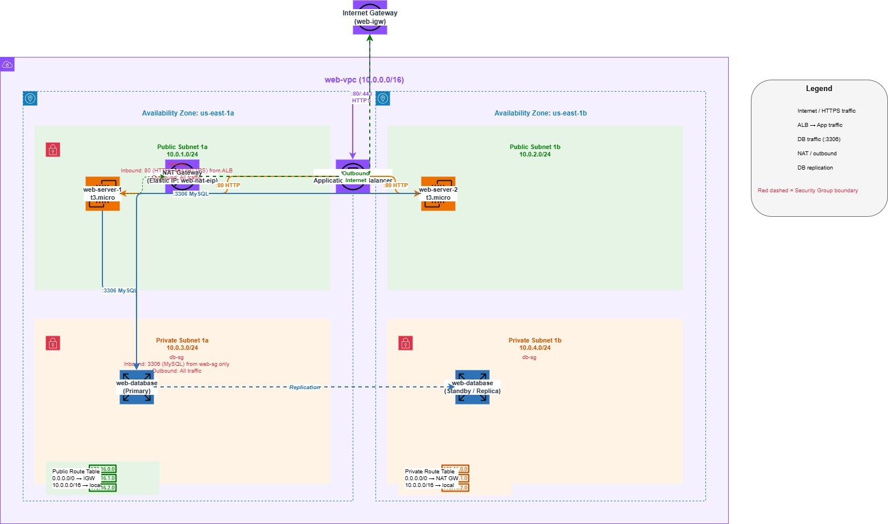
- Screenshots of working web application
    Open the file in preview mode to see the screenshots.
- Brief explanation of security setup
    The Web Server Security Group,it Allows users to access the web application via HTTP,HTTPS.
    Source is 0.0.0.0/0 because web traffic comes from any internet user.
    The SSH access into EC2 instances for administration purpose is restricted to my IP only.
    The outbound rule allows EC2 instances to make outbound connections
    The ALB will forward traffic to EC2 instances on port 80
    The database security group is attached to your RDS MySQL database and has a single inbound rule that allows MySQL traffic on port 3306, but only from the web security group (web-sg).
    The public route table (public-rt) is associated with public subnets and contains two routes: the first route says that any traffic destined for 10.0.0.0/16 ( internal VPC network) should stay local within the VPC, and the second route says that any traffic destined for anywhere else (0.0.0.0/0, which represents the entire internet) should be sent to the Internet Gateway.
    The Internet Gateway (web-igw) is the gateway that connects your VPC to the internet, allowing bidirectional communication between your public subnets and the internet. 
    The  private route table (private-rt) associated with  private subnets. It also has two routes: traffic destined for 10.0.0.0/16 stays local, but traffic destined for anywhere else (0.0.0.0/0) is sent to the NAT Gateway instead of the Internet Gateway.
    If the database needs to download updates or patches, it initiates outbound connections through the NAT Gateway, which translates the private IP to a public IP, sends the traffic through the Internet Gateway to the internet, and translates the response back.
    For current application, the default NACLs are sufficient because security groups provide the primary access control.
