## Assignment 2: Simple Serverless Application

**Objective:** Build a basic serverless web application using AWS services.

**Tasks:**

1. **Frontend:**
    **This is already covered**
    - Create a simple “Hello World” HTML/CSS web page
    - Host it on S3 as a static website
    - Enable public access for website hosting
2. **Backend API:**
    - Create a simple DynamoDB table
    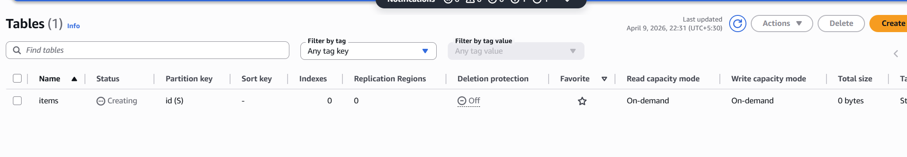
    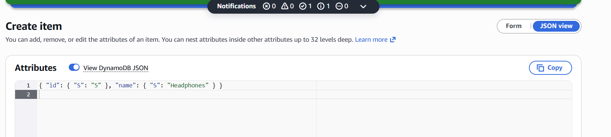
    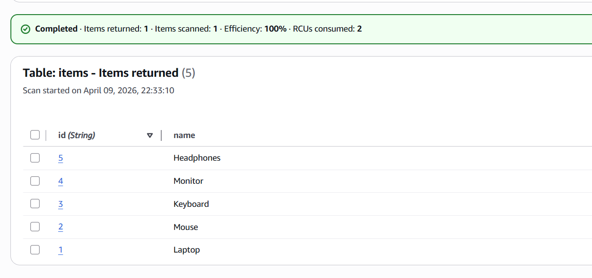
    Created role -:
    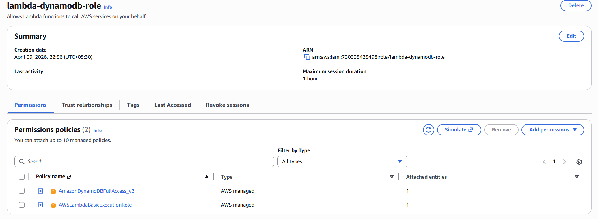
    - Create 2 API Gateway endpoints (GET and POST)
    - Create 2 Lambda functions in Python:
        - One to retrieve data from DynamoDB
        - One to store data in DynamoDB
    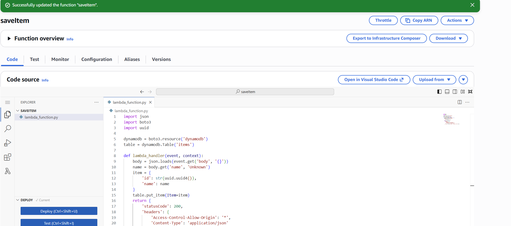
    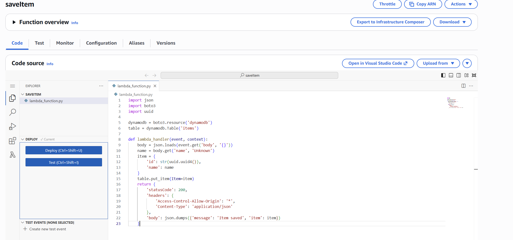

    Test-:
    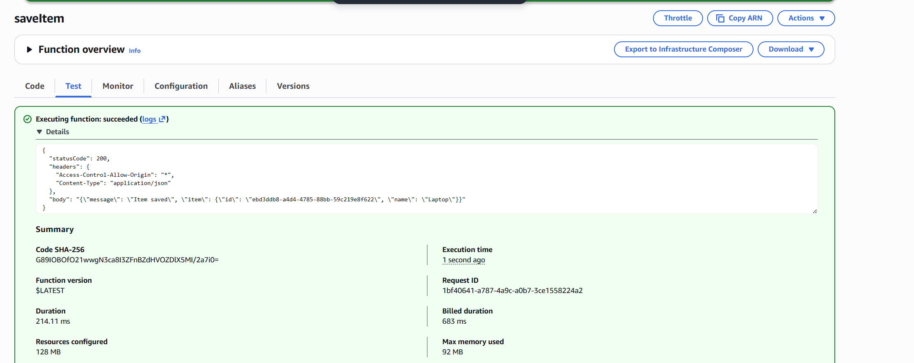
    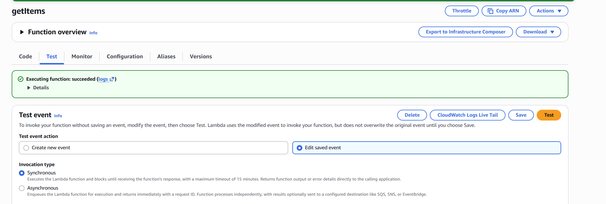

    API Gateway-:
    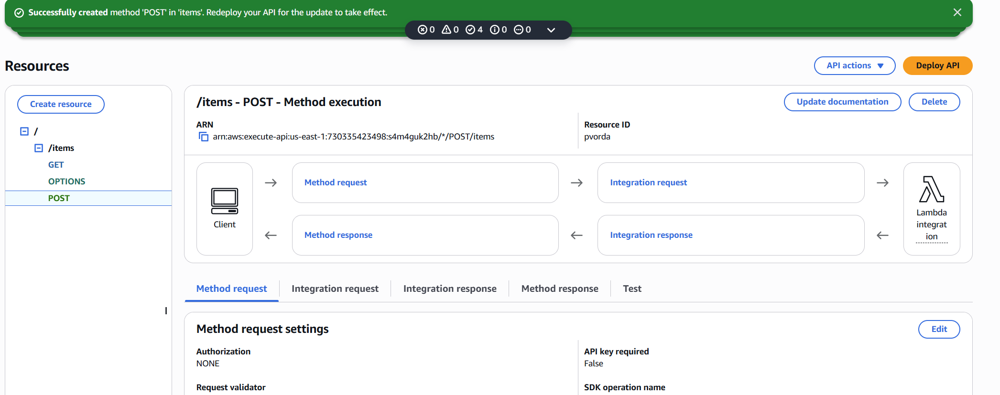
    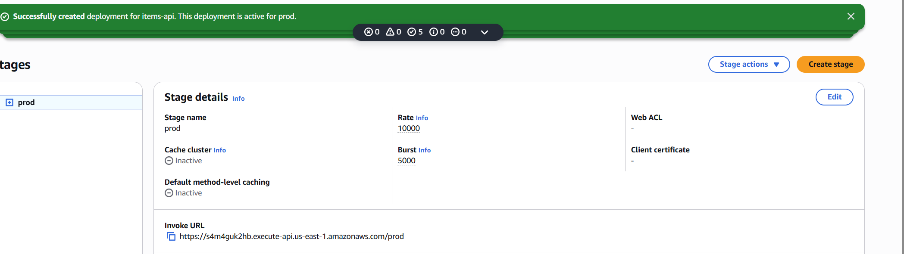

    Testing-:

    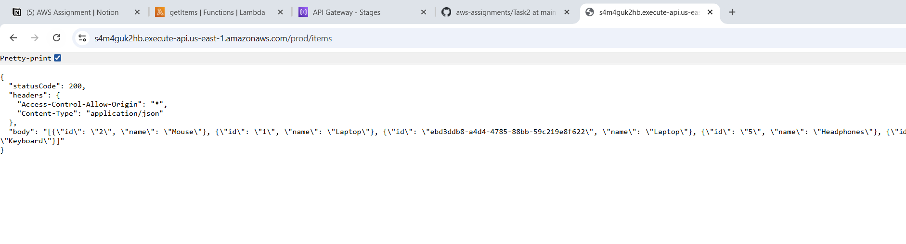

    
3. **Basic Monitoring:**
    - Enable CloudWatch logs for Lambda functions
    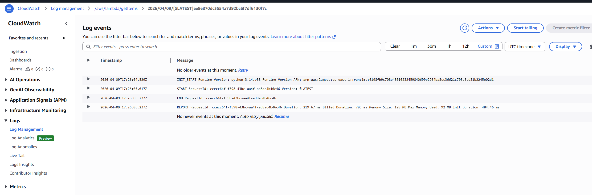
    - Create one CloudWatch alarm for Lambda errors
    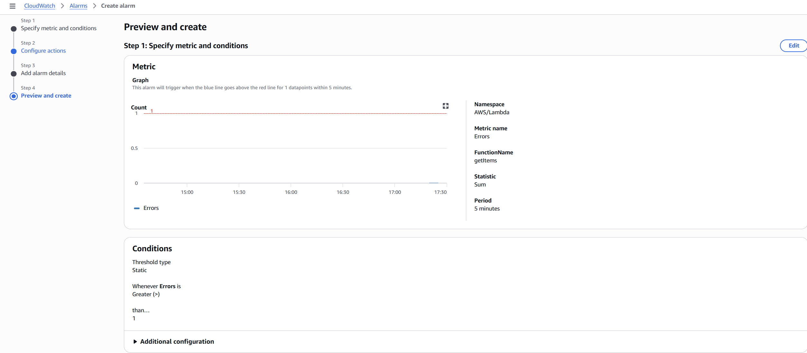
    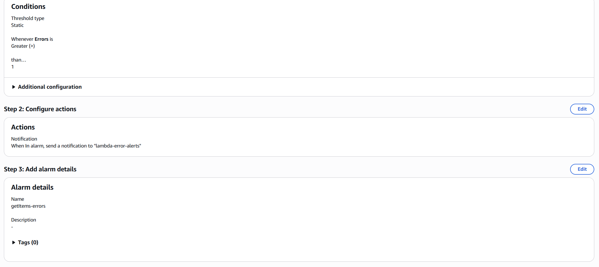
    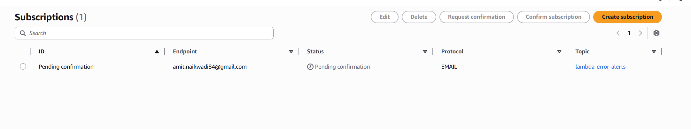
    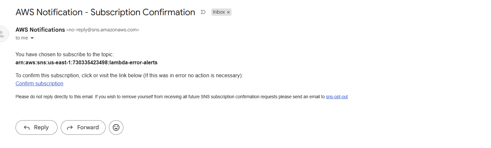

**Deliverables:**

- Working web application
- Lambda function code
- Screenshots of API testing