**Objective:** Understand different AWS storage options and their use cases.

**Tasks:**

1. **S3 Storage:**
    - Create an S3 bucket with proper security settings
    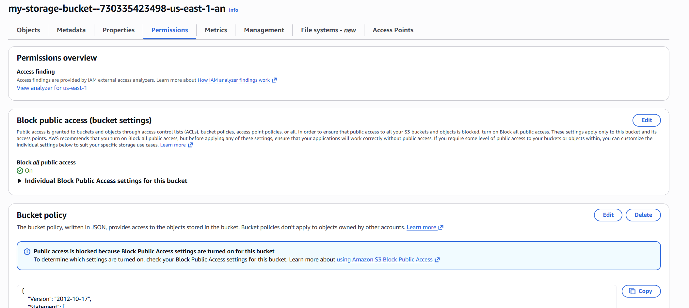

    - Upload different file types
    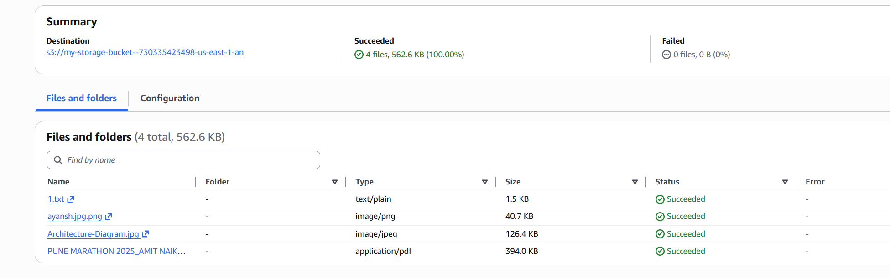

    
    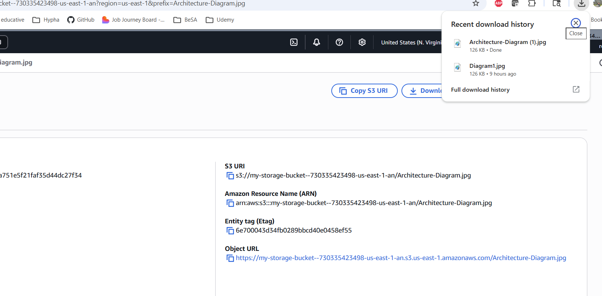
    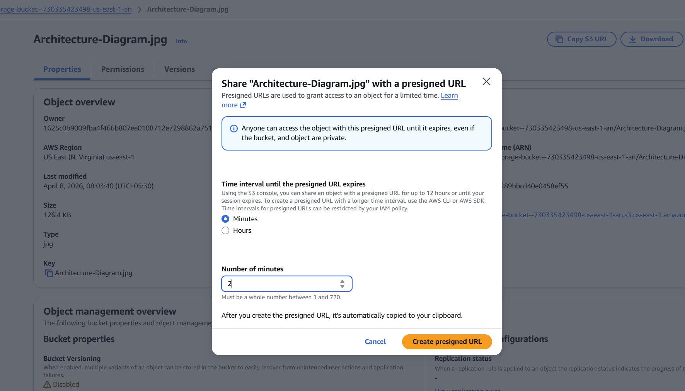
    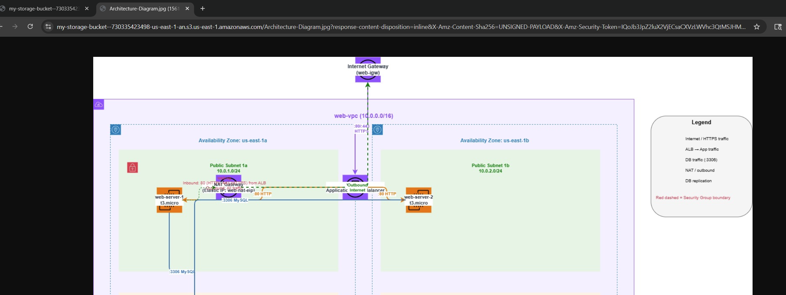
    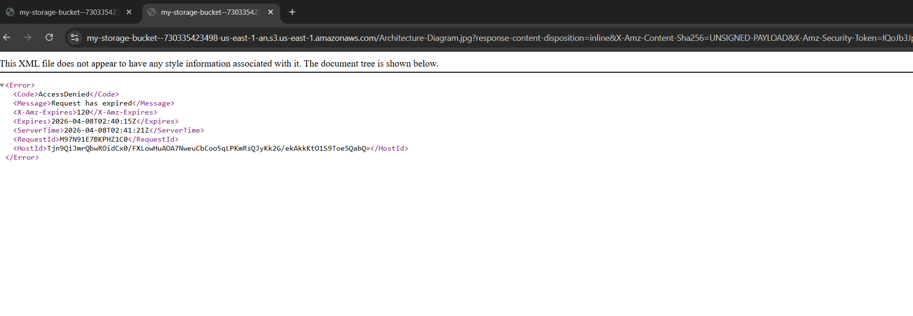

    - Configure one lifecycle policy (move to cheaper storage after 30 days)

    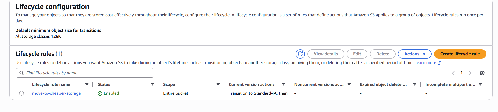
    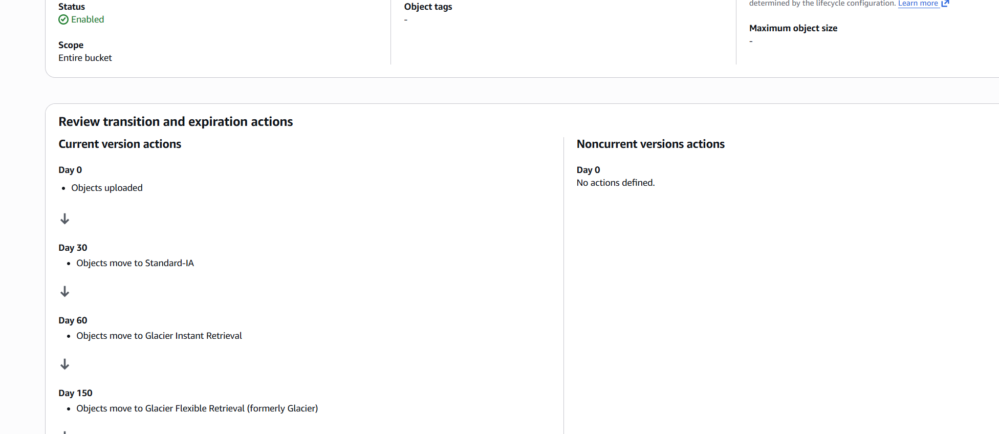
    - Create a simple static website

    
    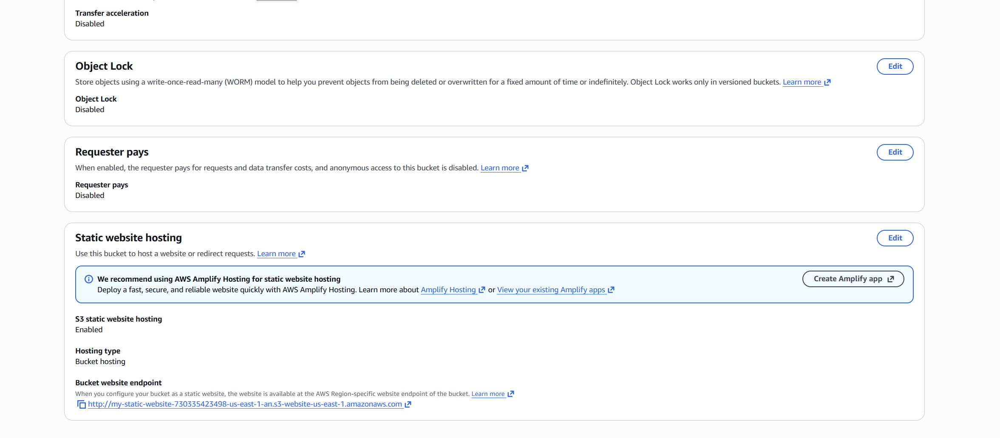
    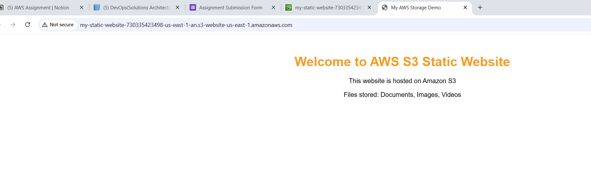

2. **EC2 Storage:**
    - Launch EC2 instance with default EBS volume
    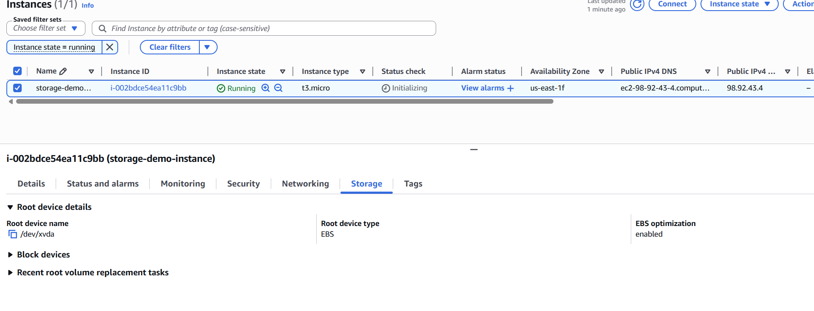
    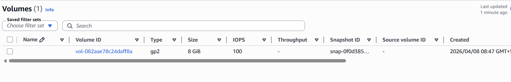
    - Create and attach one additional EBS volume
    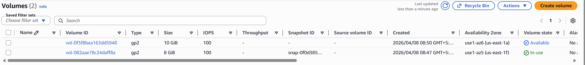
    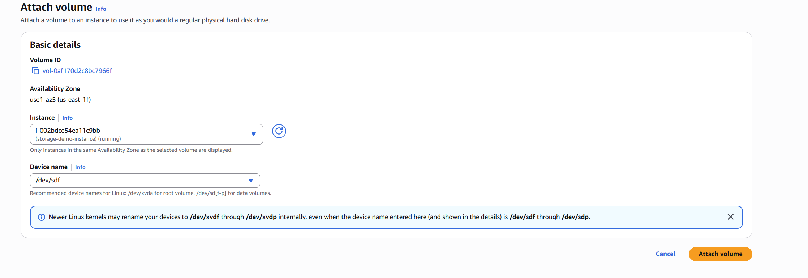
    - Test basic file operations and performance
    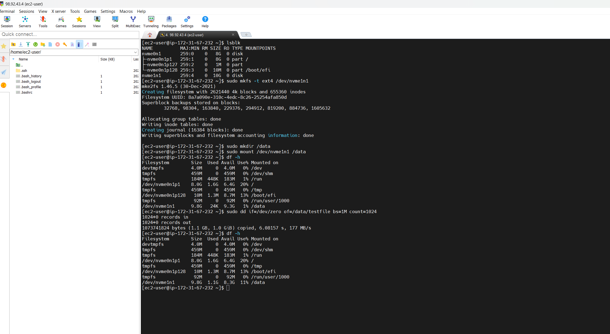
3. **File Sharing:**
    - Create an EFS file system
    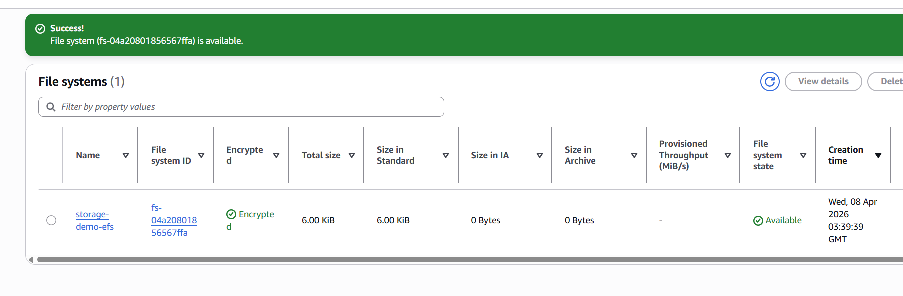
    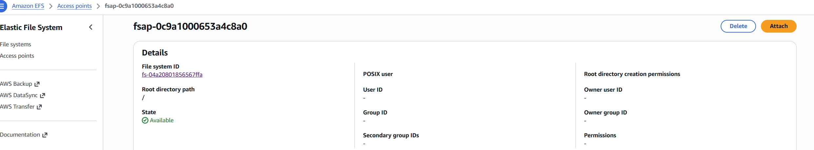
    - Mount it to 2 EC2 instances
    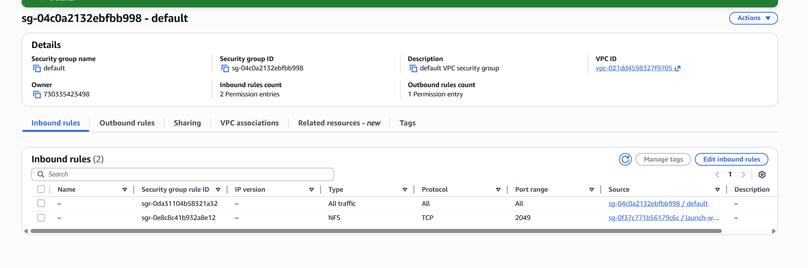
    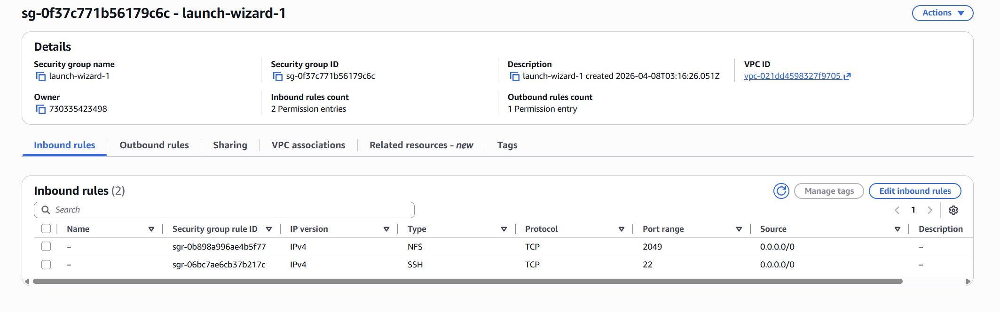
    
    
    - Test concurrent file access
    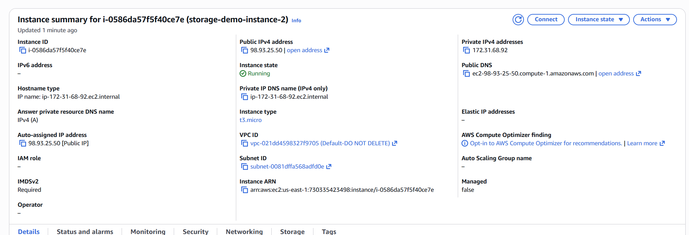
    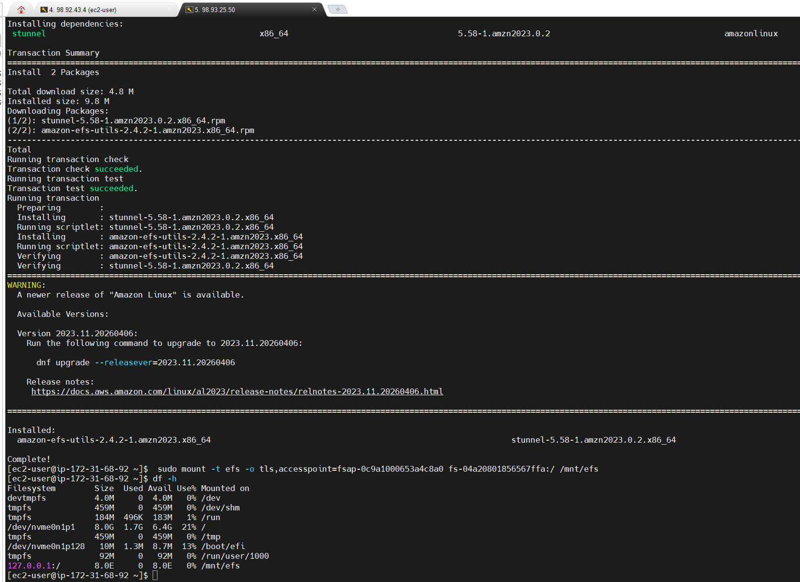
    
    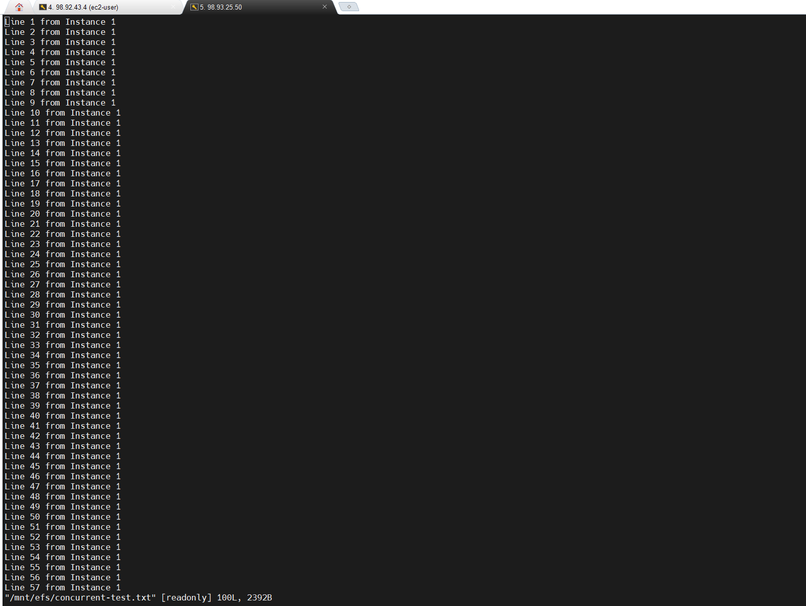
    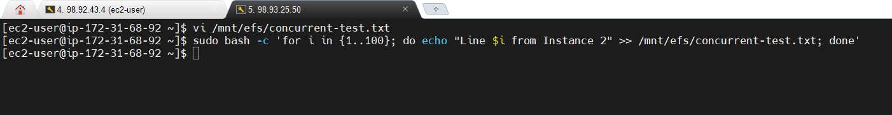
    

**Use S3 When:**
- Storing backups and archives
- Hosting static websites
- Storing large datasets for analytics
- Need unlimited scalability
- Cost is primary concern
- Infrequent access patterns

**Use EBS When:**
- Running databases (MySQL, PostgreSQL)
- Need high performance for single instance
- Require persistent block storage
- Need low latency (<2ms)
- Running file systems (ext4, NTFS)
- Performance is critical

**Use EFS When:**
- Multiple instances need shared storage
- Running collaborative applications
- Need NFS file system
- Require concurrent access
- Building content repositories
- Running containerized applications
