**Objective:** Implement basic security controls in AWS.

**Tasks:**

1. **Identity Management:**
    - Create IAM users with MFA enabled
    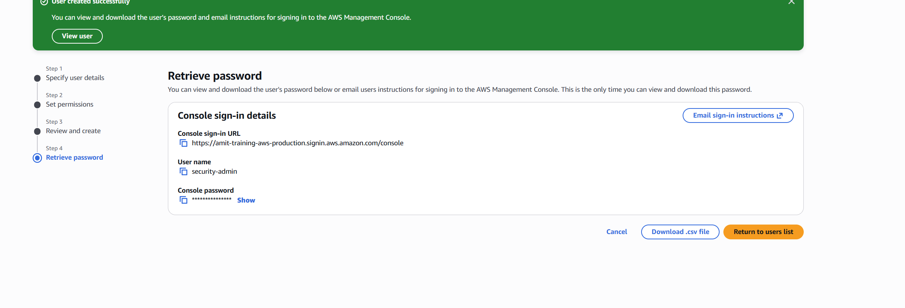
    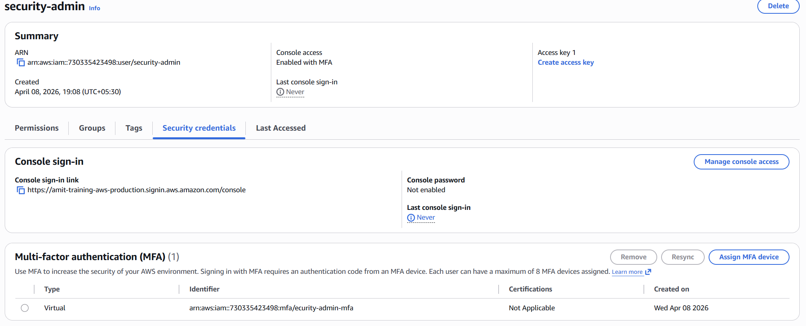
    - Create IAM groups with appropriate permissions
    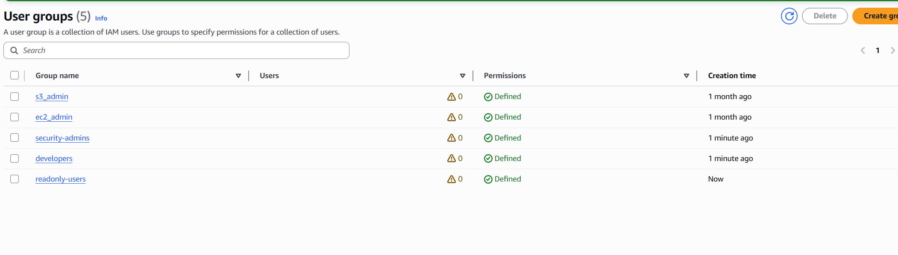
    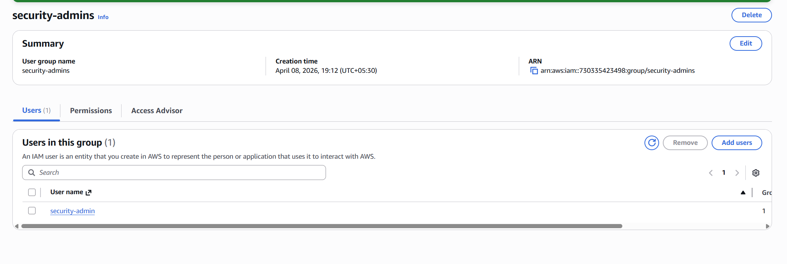
    - Create IAM roles for EC2 instances
    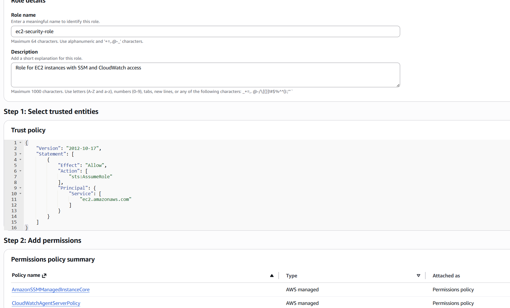
    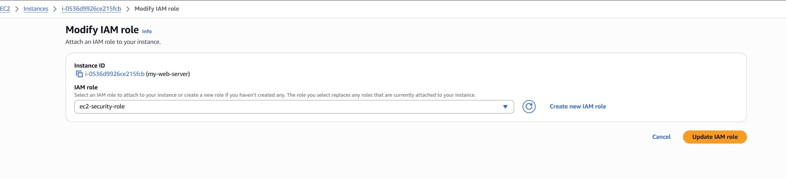
    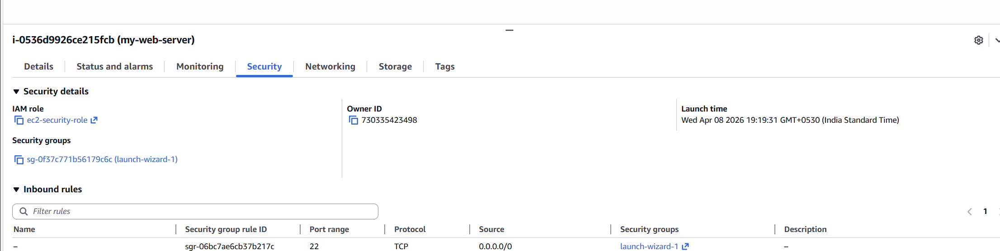
    - Follow least privilege principle
    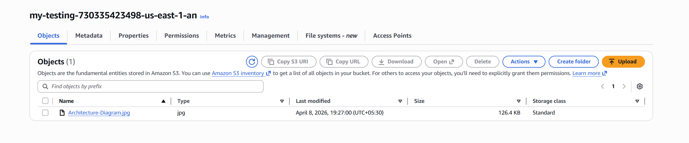
    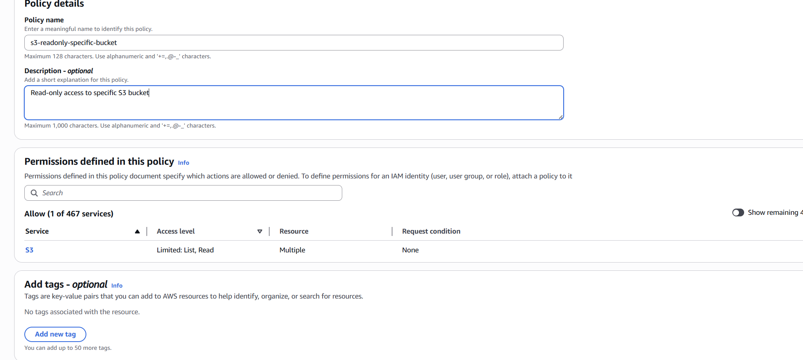
    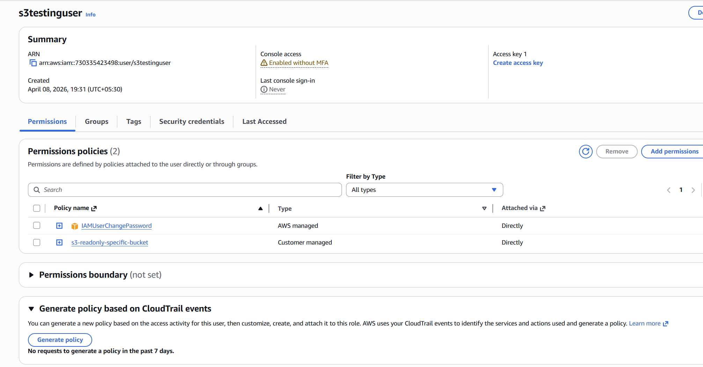
    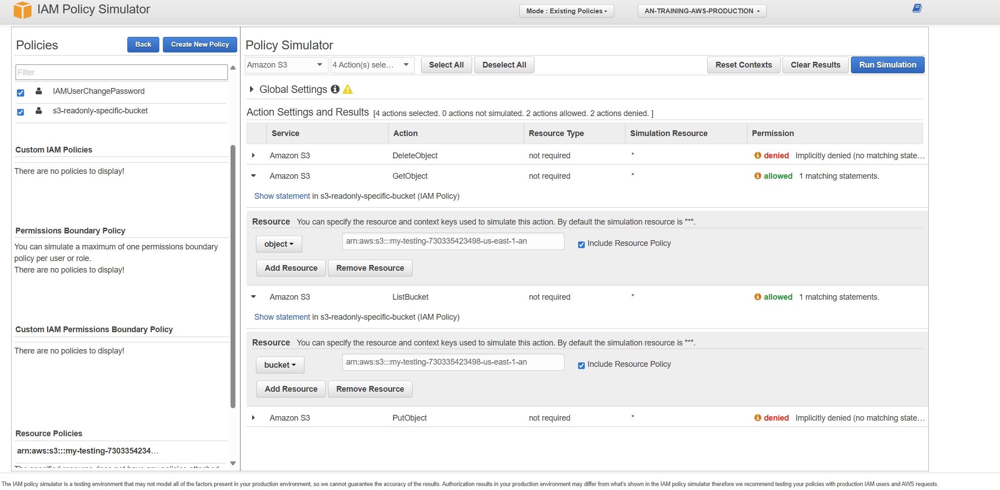
2. **Network Security:**
    - Create VPC with public and private subnets
    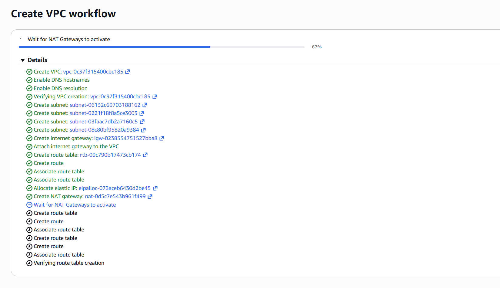
    - Configure security groups with minimal required access
    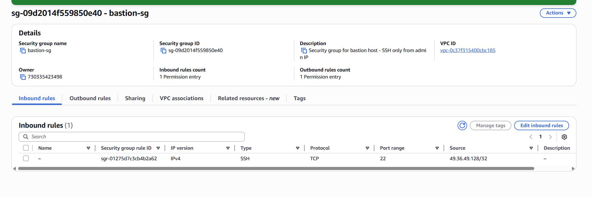
    
    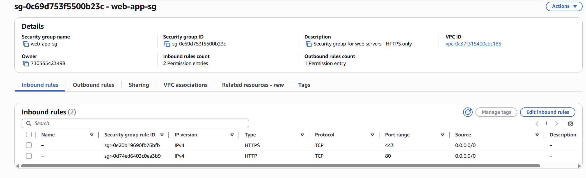
    - Set up VPC Flow Logs
    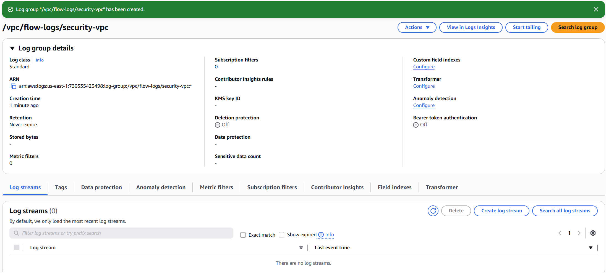
    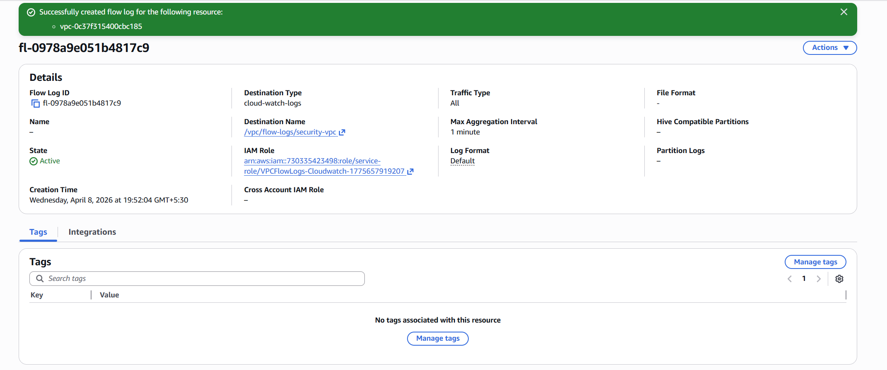
    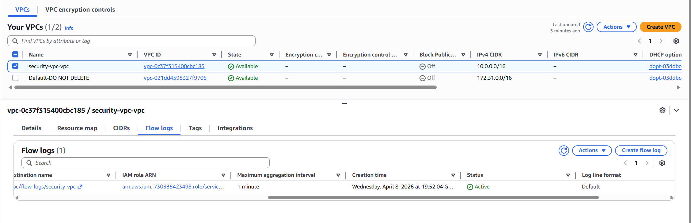
    - Create a bastion host for secure access
    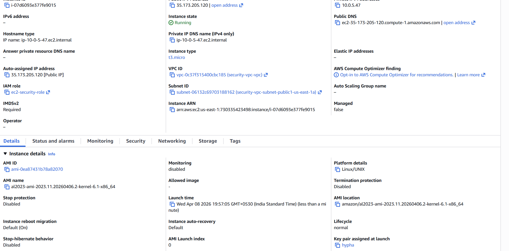
    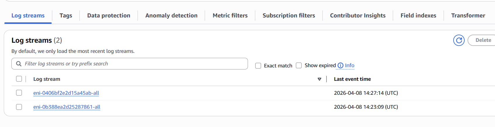
    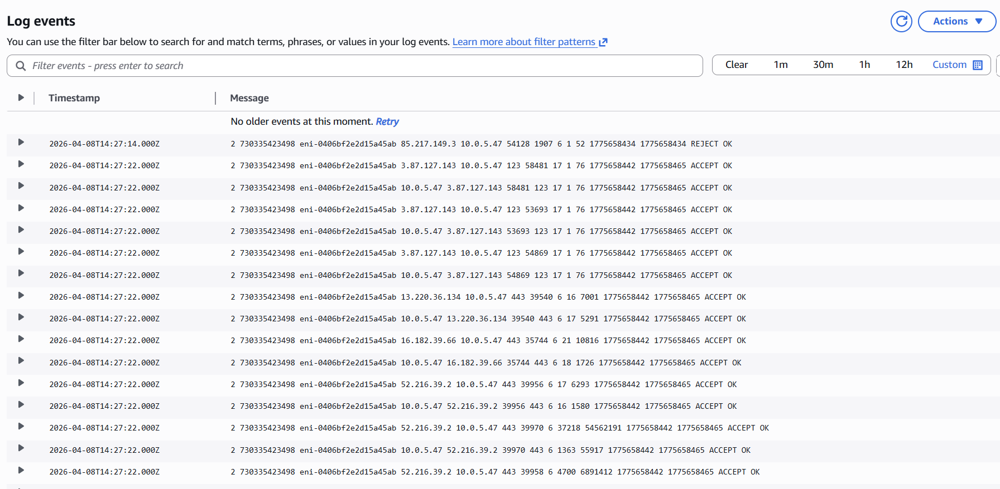
3. **Data Protection:**
    - Enable encryption for:
        - S3 bucket
        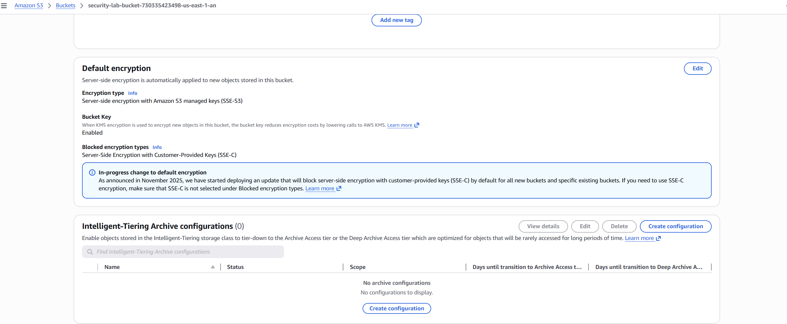
        - EBS volumes
        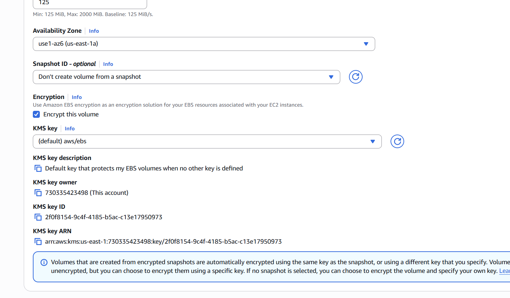
        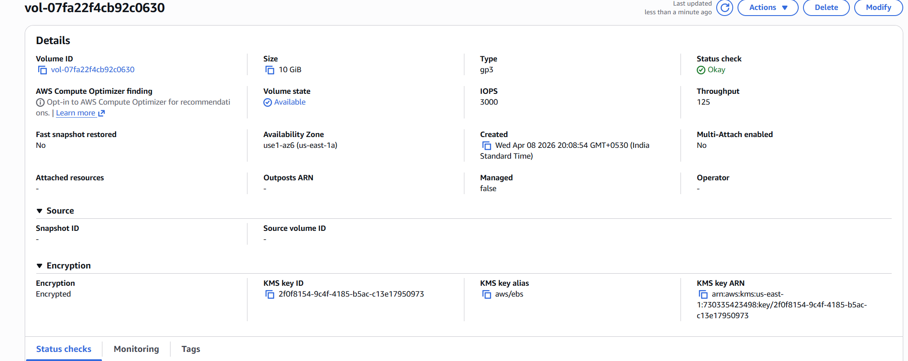
        - RDS database
    - Configure HTTPS using AWS Certificate Manager
4. **Security Monitoring:**
    - Enable AWS Config for basic compliance checking
    - Set up GuardDuty for threat detection
    - Review and document security findings

**Deliverables:**

- Security architecture diagram
- Screenshots of security configurations
- Brief security assessment report